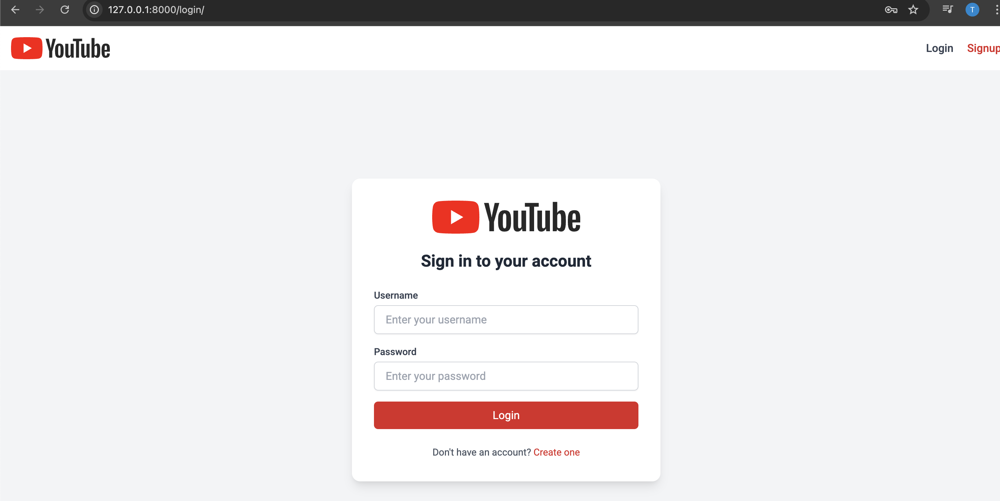
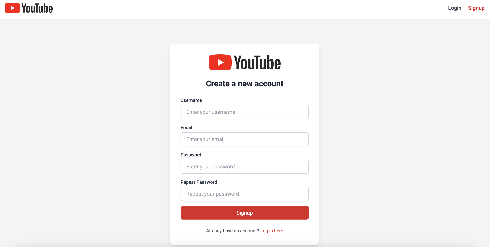
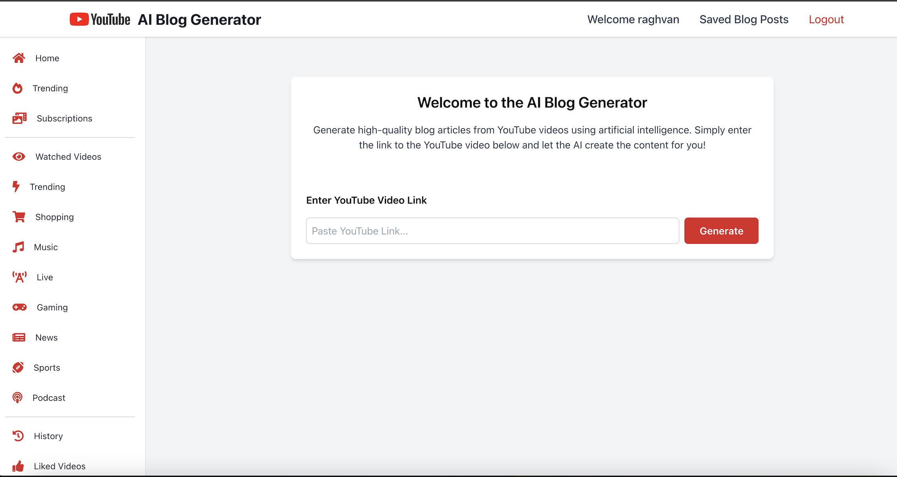
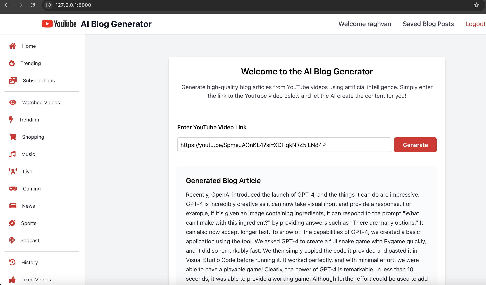
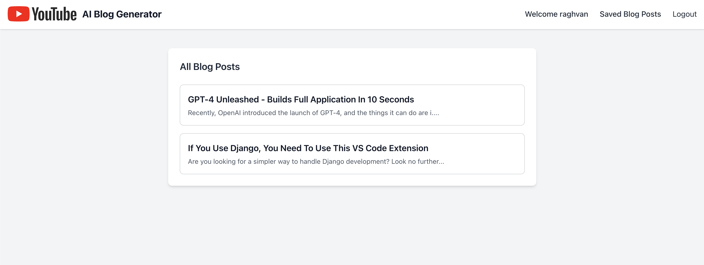
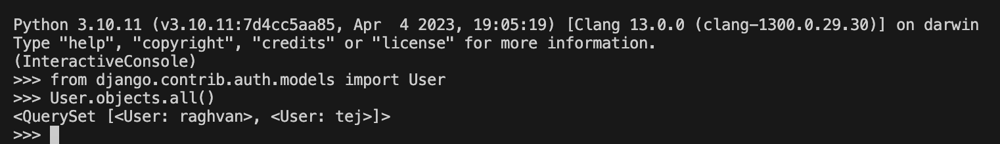

# 🧠 AI Blog Generator

A Django-based web application that automatically generates blog posts from YouTube video URLs using **AssemblyAI** for transcription and **OpenAI GPT** for content generation.

---

## 🚀 Features

- 🔐 User authentication (Sign up, Login, Logout)
- 🔗 Submit a YouTube video URL and auto-generate blog content
- 📝 Transcribes audio using **AssemblyAI**
- ✍️ Summarizes and turns transcript into a full blog using **OpenAI GPT**
- 📚 View all generated blogs
- 🔍 View individual blog details
- 👥 Admin page to view all signed-up users (superuser only)

---

## 🛠 Tech Stack

| Category       | Tools Used                             |
|----------------|----------------------------------------|
| Backend        | Django, SQLite3                        |
| AI APIs        | OpenAI GPT, AssemblyAI                 |
| Frontend       | HTML5, CSS3, Django Templates          |
| Authentication | Django Auth                            |
| Deployment     | (Optional) Heroku / Render / Vercel    |

---

## 📸 Screenshots (Detailed Preview)

> _Screenshots are located in the `screenshots/` folder._

### 🔐 Login & Signup Pages

**Screenshot 1: Login Page**  
Users can log in securely using their credentials.



**Screenshot 2: Signup Page**  
New users can register by providing their username, email, and password.



---

### 🏠 Home Page & Blog Generator

**Screenshot 3: Home Page**  
After login, users see a dashboard to input YouTube video URLs.



**Screenshot 4: Blog Generator**  
User pastes a YouTube link and submits it to generate a blog from the video content.



---

### 📚 Saved Blogs & Blog Details

**Screenshot 5: All Blogs Page**  
Displays all blogs created by the logged-in user, listed in reverse chronological order.



---

### 👥 User Management (Admin)

**Screenshot 6: User Details**  
Admins can view how many users have signed up in the system.



---
## 🗂 Media Folder

The `media/` directory is used for temporarily storing the downloaded audio (in `.mp3` format) from YouTube before it's uploaded to AssemblyAI.

- Example path: `media/81c9c123-xyz.mp3`
- Files are deleted automatically after transcription to save space.
- If you want to retain them for debugging, comment out the cleanup line in `views.py`:

## 🧪 Usage

1. Register or log in.
2. Paste a YouTube video URL on the homepage.
3. Wait while the video is transcribed and summarized.
4. View and manage your generated blog posts in your dashboard.

---

## 🔑 API Key Setup

This project uses external APIs — you’ll need API keys to run it:

### 1. **AssemblyAI**
- Sign up at [assemblyai.com](https://www.assemblyai.com)
- Copy your API key
- Add it to a `.env` file or set it in your environment

### 2. **OpenAI**
- Get your API key from [platform.openai.com](https://platform.openai.com)
- Copy your key
- Add it to your `.env` file

### ✅ Create a `.env` file in your project root:

```env
OPENAI_API_KEY=your-openai-api-key
ASSEMBLYAI_API_KEY=your-assemblyai-api-key
